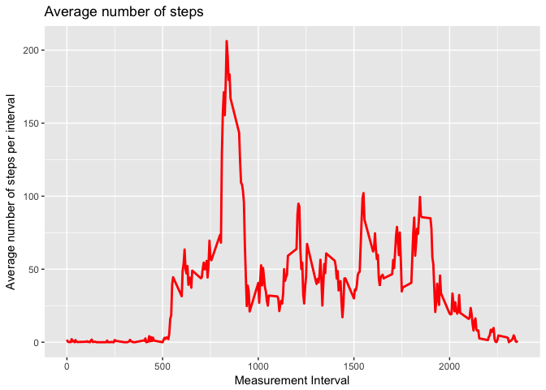

# Reproducible Research: Peer Assessment 1

##Veronika Gajdosova

### Project description:

It is now possible to collect a large amount of data about personal movement using activity monitoring devices such as a Fitbit, Nike Fuelband, or Jawbone Up. These type of devices are part of the “quantified self” movement – a group of enthusiasts who take measurements about themselves regularly to improve their health, to find patterns in their behavior, or because they are tech geeks. But these data remain under-utilized both because the raw data are hard to obtain and there is a lack of statistical methods and software for processing and interpreting the data.

This assignment makes use of data from a personal activity monitoring device. This device collects data at 5 minute intervals through out the day. The data consists of two months of data from an anonymous individual collected during the months of October and November, 2012 and include the number of steps taken in 5 minute intervals each day.

### Data for analysis

The data for this assignment can be downloaded from [Activity monitoring data](http://d396qusza40orc.cloudfront.net/repdata%2Fdata%2Factivity.zip).

### Variable description:

- **steps**: Number of steps taking in a 5-minute interval (missing values are coded as 𝙽𝙰)
- **date**: The date on which the measurement was taken in YYYY-MM-DD format
- **interval**: Identifier for the 5-minute interval in which measurement was taken

*note:The dataset is stored in a comma-separated-value (CSV) file and there are a total of 17,568 observations in this dataset.*

## Loading and preprocessing the data

We will start our analysis by reading of the data and showing a summary of them.


```r
activity <- read.csv("activity.csv")
head(activity)
```

```
##   steps       date interval
## 1    NA 2012-10-01        0
## 2    NA 2012-10-01        5
## 3    NA 2012-10-01       10
## 4    NA 2012-10-01       15
## 5    NA 2012-10-01       20
## 6    NA 2012-10-01       25
```

```r
summary(activity)
```

```
##      steps                date          interval     
##  Min.   :  0.00   2012-10-01:  288   Min.   :   0.0  
##  1st Qu.:  0.00   2012-10-02:  288   1st Qu.: 588.8  
##  Median :  0.00   2012-10-03:  288   Median :1177.5  
##  Mean   : 37.38   2012-10-04:  288   Mean   :1177.5  
##  3rd Qu.: 12.00   2012-10-05:  288   3rd Qu.:1766.2  
##  Max.   :806.00   2012-10-06:  288   Max.   :2355.0  
##  NA's   :2304     (Other)   :15840
```

```r
str(activity)
```

```
## 'data.frame':	17568 obs. of  3 variables:
##  $ steps   : int  NA NA NA NA NA NA NA NA NA NA ...
##  $ date    : Factor w/ 61 levels "2012-10-01","2012-10-02",..: 1 1 1 1 1 1 1 1 1 1 ...
##  $ interval: int  0 5 10 15 20 25 30 35 40 45 ...
```

```r
dim(activity)
```

```
## [1] 17568     3
```

```r
tail(activity)
```

```
##       steps       date interval
## 17563    NA 2012-11-30     2330
## 17564    NA 2012-11-30     2335
## 17565    NA 2012-11-30     2340
## 17566    NA 2012-11-30     2345
## 17567    NA 2012-11-30     2350
## 17568    NA 2012-11-30     2355
```

As we see, the data consists of the three variables described under *Variable description* above.
There are a total of 17,568 observations in this dataset.

Let's transform the data into a format that is suitable for our analysis. 

1. The variable data needs to be converted from character to date format.


```r
class(activity$date)
```

```
## [1] "factor"
```

```r
activity$date<- as.Date(activity$date)
class(activity$date)
```

```
## [1] "Date"
```

2. Subsetting a cleaner data set without NAs:


```r
clean_data <- activity[!is.na(activity$steps),]
summary(clean_data)
```

```
##      steps             date               interval     
##  Min.   :  0.00   Min.   :2012-10-02   Min.   :   0.0  
##  1st Qu.:  0.00   1st Qu.:2012-10-16   1st Qu.: 588.8  
##  Median :  0.00   Median :2012-10-29   Median :1177.5  
##  Mean   : 37.38   Mean   :2012-10-30   Mean   :1177.5  
##  3rd Qu.: 12.00   3rd Qu.:2012-11-16   3rd Qu.:1766.2  
##  Max.   :806.00   Max.   :2012-11-29   Max.   :2355.0
```

```r
dim(clean_data)
```

```
## [1] 15264     3
```

We can compare the dimension of the new data set, where we had information about the number of NAs, so we see that our data set is now without missing values and ready for further analysis.

## What is mean total number of steps taken per day?

### Total number of steps taken per day

Let us now calculate the total daily steps.


```r
library(ggplot2)
```

```
## Warning: package 'ggplot2' was built under R version 3.3.2
```

```r
library(plyr)
library(dplyr)
```

```
## 
## Attaching package: 'dplyr'
```

```
## The following objects are masked from 'package:plyr':
## 
##     arrange, count, desc, failwith, id, mutate, rename, summarise,
##     summarize
```

```
## The following objects are masked from 'package:stats':
## 
##     filter, lag
```

```
## The following objects are masked from 'package:base':
## 
##     intersect, setdiff, setequal, union
```

```r
TotalDailySteps <- tapply(clean_data$steps, clean_data$date, sum)
hist(TotalDailySteps, breaks=5, xlab="Number of steps", main="Total number of steps taken daily")
```

<!-- -->
 
### Calculation of the mean and median of the total number of steps taken per day


```r
mean_steps <- as.integer(mean(TotalDailySteps))
median_steps <- as.integer(median(TotalDailySteps))
```

The mean number of steps taken daily was 10766, while the median number of steps corresponds to 10765.


## What is the average daily activity pattern?

### Time series plot of the 5-minute interval (x-axis) and the average number of steps taken, averaged across all days (y-axis)

```r
library(ggplot2)
library(plyr)
clean_data <- activity[!is.na(activity$steps),]
#Average number of steps per interval
mes_interval<- ddply(clean_data, .(interval), summarize, Avg = mean(steps))

#Time series plot of the average number of steps per interval
ggplot(mes_interval, aes(x =interval , y=Avg)) +
        geom_line(color="red", size=1) +
        labs(title = "Average number of steps", x = "Measurement Interval", y = "Average number of steps per interval")
```

<!-- -->

### Identification of the 5-minute interval that contains (on average across all the days in the dataset) the maximum number of steps


```r
maximum_steps <- max(mes_interval$Avg)
#maximum_steps <- round(maximum_steps)
top_interval<- mes_interval[mes_interval$Avg==maximum_steps,1]
top_interval
```

```
## [1] 835
```

The maximum number of steps for 5-minute interval was 206. This corresponds to the 835 interval.


##Imputing missing values


### Calculation of the total number of missing values in the dataset 


```r
nrow(activity[is.na(activity$steps),])
```

```
## [1] 2304
```

### Filling in of the missing values. Creating a new dataset with the missing data filled in.

The strategy used to impute the missing values is by using the mean number of steps in the corresponding 5-minute interval. 


```r
#creating a new dataset identical to the original one
activity_new <- activity
#finding the NAs, mean and filling in the mean into the missing values
missing_values <- is.na(activity_new$steps)
avg_interval<- tapply(activity_new$steps, activity_new$interval, mean, na.rm=TRUE, simplify = TRUE)
activity_new$steps[missing_values] <- avg_interval[as.character(activity_new$interval[missing_values])]
#checking if there are no more NAs
sum(is.na(activity_new))
```

```
## [1] 0
```

```r
#column arrangment
activity_new<- activity_new[, c("date", "interval", "steps")]
head(activity_new)
```

```
##         date interval     steps
## 1 2012-10-01        0 1.7169811
## 2 2012-10-01        5 0.3396226
## 3 2012-10-01       10 0.1320755
## 4 2012-10-01       15 0.1509434
## 5 2012-10-01       20 0.0754717
## 6 2012-10-01       25 2.0943396
```
There are no more NAs, so we seem to have imputed the values correctly.

### Histogram of the total number of steps taken each day and calculation of the mean and median total number of steps taken per day. 


```r
TotalDailySteps_full <- activity_new %>%
  filter(!is.na(steps)) %>%
  group_by(date) %>%
  summarize(steps = sum(steps)) %>%
  print
```

```
## # A tibble: 61 × 2
##          date    steps
##        <date>    <dbl>
## 1  2012-10-01 10766.19
## 2  2012-10-02   126.00
## 3  2012-10-03 11352.00
## 4  2012-10-04 12116.00
## 5  2012-10-05 13294.00
## 6  2012-10-06 15420.00
## 7  2012-10-07 11015.00
## 8  2012-10-08 10766.19
## 9  2012-10-09 12811.00
## 10 2012-10-10  9900.00
## # ... with 51 more rows
```


```r
ggplot(TotalDailySteps_full, aes(x = steps)) +
  geom_histogram(fill = "red", binwidth = 1000) +
  labs(title = "Histogram of Steps per day after imputing missing values", x = "Total steps per day", y = "Frequency")
```

<!-- -->

Now, we will calculate the mean and median after imputing the data and have a look if these differ from the estimates from the first part of the assignment


```r
mean_steps_full <- mean(TotalDailySteps_full$steps)
mean_steps_full
```

```
## [1] 10766.19
```

```r
median_steps_full <- median(TotalDailySteps_full$steps)
median_steps_full
```

```
## [1] 10766.19
```

The impact of using the average number of steps in the corresponding 5-min interval for filling in the missing values, results in the mean and median of steps being both equal to 10766.19.


## Are there differences in activity patterns between weekdays and weekends?

We will use the dataset with the filled-in missing values in order to assess the differences in activity patterns between weekdays and weekends. 


```r
head(activity_new)
```

```
##         date interval     steps
## 1 2012-10-01        0 1.7169811
## 2 2012-10-01        5 0.3396226
## 3 2012-10-01       10 0.1320755
## 4 2012-10-01       15 0.1509434
## 5 2012-10-01       20 0.0754717
## 6 2012-10-01       25 2.0943396
```

We will create a new factor variable in the dataset with two levels – “weekday” and “weekend” indicating whether a given date is a weekday or weekend day.


```r
activity_new<- activity_new %>%
        mutate(weektype= ifelse(weekdays(activity_new$date)=="Saturday" |    weekdays(activity_new$date)=="Sunday", "Weekend", "Weekday"))
```

```r
head(activity_new)
```

```
##         date interval     steps weektype
## 1 2012-10-01        0 1.7169811  Weekday
## 2 2012-10-01        5 0.3396226  Weekday
## 3 2012-10-01       10 0.1320755  Weekday
## 4 2012-10-01       15 0.1509434  Weekday
## 5 2012-10-01       20 0.0754717  Weekday
## 6 2012-10-01       25 2.0943396  Weekday
```


### Panel plot containing a time series plot (i.e. 𝚝𝚢𝚙𝚎 = "𝚕") of the 5-minute interval (x-axis) and the average number of steps taken, averaged across all weekday days or weekend days (y-axis). 


```r
mes_interval2<- ddply(activity_new, .(interval, weektype), summarize, Avg = mean(steps))
head(mes_interval2)
```

```
##   interval weektype        Avg
## 1        0  Weekday 2.25115304
## 2        0  Weekend 0.21462264
## 3        5  Weekday 0.44528302
## 4        5  Weekend 0.04245283
## 5       10  Weekday 0.17316562
## 6       10  Weekend 0.01650943
```


```r
plot<- ggplot(mes_interval2, aes(x =interval , y=Avg, color=weektype)) +
       geom_line() +
       labs(title = "Avgerage Daily Steps by Weektype", x = "Interval", y = "Number of Steps") +
       facet_wrap(~weektype, ncol = 1, nrow=2)
print(plot)
```

<!-- -->

There is a clear pattern difference between the weekdays and weekends. The person wearing the activity tracker is more active throughout the weekends (possible reason: sedatory work over week) and also the activity starts sooner on weekdays, related most probably to getting up earlier and going to work. 


